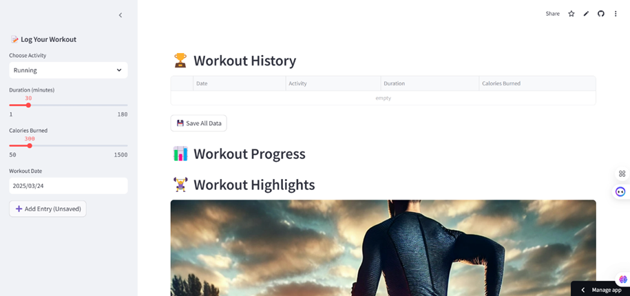

# 💪 Personal Fitness Tracker

🚀 **A Premium AI-Powered Fitness Tracker with an Interactive UI**
 

---

## 🌟 Features

✅ **Modern UI with Premium Design**  
✅ **Track workouts manually (Running, Cycling, Gym, Yoga, Swimming, etc.)**  
✅ **Interactive progress charts with Plotly** 📊  
✅ **User-controlled data saving (No auto-save!)** 💾  
✅ **Dark Mode & Glassmorphism UI for a sleek look** 🖤  
✅ **Free & Open Source – No subscriptions!**  

---

## 🚀 Live Demo  

🔗 **Try it here:** [Live Demo](https://trackmygains.streamlit.app/)  
  
---
## 🛠️ Installation Guide

1️⃣ **Clone the Repository:**  
```bash
git clone https://github.com/Jayanth0124/fitness-tracker.git
cd fitness-tracker
```  
2️⃣ **Install Required Packages:**  
```bash
pip install -r requirements.txt
```  
3️⃣ **Run the Application:**  
```bash
streamlit run fit.py
```  

---

## 📌 Usage Instructions

1. **Log your workout manually** using the sidebar form.  
2. **View progress with interactive charts & metrics.**  
3. **Click "Save All Data"** to store your workout history.  
4. **Modify UI settings** to match your preferences.  

---

## 🖼️ Screenshots  

  
📌 *Modern Glassmorphism UI with sleek charts.*  


---

## 📂 Project Structure  

```
📂 fitness-tracker/  
│-- 📂 images/               # UI Images & Backgrounds  
│-- 📜 fit.py                # Main Application Code  
│-- 📜 requirements.txt      # Dependencies  
│-- 📜 README.md             # Project Documentation  
```  

---

## 🎯 Future Enhancements  

🚀 **AI-Powered Recommendations** (Personalized workouts)  
☁️ **Cloud-Based Storage** (Sync across devices)  
📱 **Mobile App Version** (For iOS & Android)  
🏆 **Social Features** (Challenges, Leaderboards)  

---

## 📜 License  
📢 **MIT License** – Feel free to modify & improve!  


---

### ⭐ _Stay Fit, Stay Motivated!_ 💪🔥  
